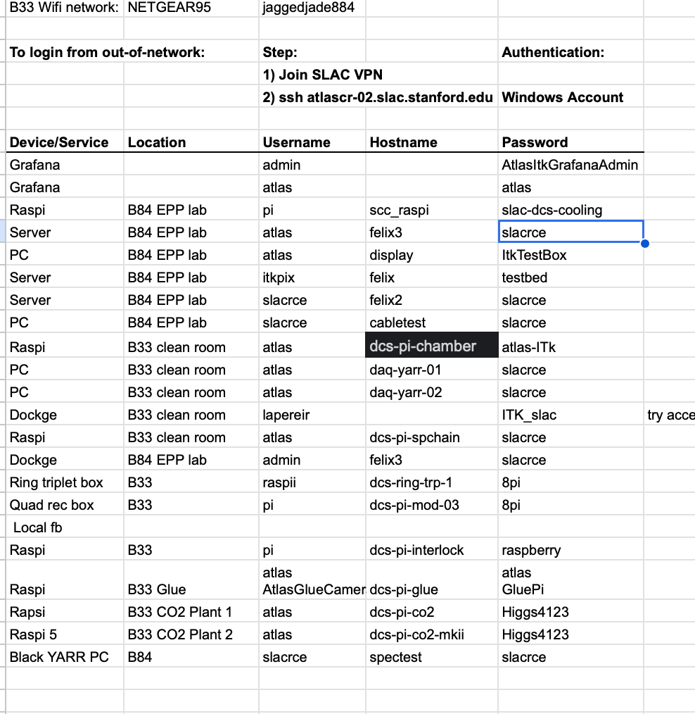
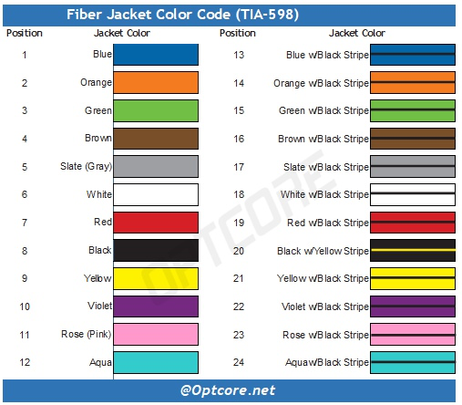

# Thermal Chamber related:
## Dew-Point Chart (°C)

Rows show **air temperature**. Columns show **relative humidity**.  
Each cell gives the approximate **dew point in °C**.

| Air °C \ RH | 10% | 20% | 30% | 40% | 50% | 60% | 70% | 80% | 90% | 100% |
|---:|---:|---:|---:|---:|---:|---:|---:|---:|---:|---:|
| -40 | -60.0 | -54.4 | -51.0 | -48.5 | -46.5 | -44.8 | -43.4 | -42.1 | -41.0 | -40.0 |
| -35 | -55.9 | -50.1 | -46.5 | -43.9 | -41.8 | -40.0 | -38.5 | -37.2 | -36.1 | -35.0 |
| -30 | -51.9 | -45.8 | -42.0 | -39.3 | -37.1 | -35.3 | -33.7 | -32.3 | -31.1 | -30.0 |
| -25 | -47.9 | -41.5 | -37.6 | -34.7 | -32.4 | -30.5 | -28.9 | -27.5 | -26.2 | -25.0 |
| -20 | -43.9 | -37.3 | -33.2 | -30.2 | -27.8 | -25.8 | -24.1 | -22.6 | -21.2 | -20.0 |
| -15 | -39.9 | -33.0 | -28.7 | -25.6 | -23.1 | -21.0 | -19.3 | -17.7 | -16.3 | -15.0 |
| -10 | -36.0 | -28.8 | -24.3 | -21.1 | -18.5 | -16.3 | -14.4 | -12.8 | -11.3 | -10.0 |
| -5 | -32.0 | -24.6 | -19.9 | -16.5 | -13.8 | -11.6 | -9.6 | -7.9 | -6.4 | -5.0 |
| 0 | -28.1 | -20.3 | -15.5 | -12.0 | -9.2 | -6.8 | -4.8 | -3.0 | -1.4 | 0.0 |
| 5 | -24.2 | -16.2 | -11.2 | -7.5 | -4.6 | -2.1 | 0.0 | 1.8 | 3.5 | 5.0 |
| 10 | -20.3 | -12.0 | -6.8 | -3.0 | 0.0 | 2.6 | 4.8 | 6.7 | 8.4 | 10.0 |
| 15 | -16.4 | -7.8 | -2.5 | 1.5 | 4.7 | 7.3 | 9.6 | 11.6 | 13.4 | 15.0 |
| 20 | -12.6 | -3.7 | 1.9 | 6.0 | 9.3 | 12.0 | 14.4 | 16.4 | 18.3 | 20.0 |
| 25 | -8.8 | 0.5 | 6.2 | 10.5 | 13.9 | 16.7 | 19.1 | 21.3 | 23.2 | 25.0 |
| 30 | -5.0 | 4.6 | 10.5 | 14.9 | 18.4 | 21.4 | 23.9 | 26.2 | 28.2 | 30.0 |
| 35 | -1.2 | 8.7 | 14.8 | 19.4 | 23.0 | 26.1 | 28.7 | 31.0 | 33.1 | 35.0 |
| 40 | 2.6 | 12.8 | 19.1 | 23.8 | 27.6 | 30.8 | 33.5 | 35.9 | 38.0 | 40.0 |

> **Electronics guideline:** Keep the coldest equipment surface at least
> **3–5°C above the listed dew point**. Below 0°C, moisture normally deposits
> as frost. Exact frost-point values may vary slightly depending on how
> relative humidity is defined and measured.

# Trial and Errors:
Current elink alignment after connecting DP3 to Port 6; DP2 to Port 1.

