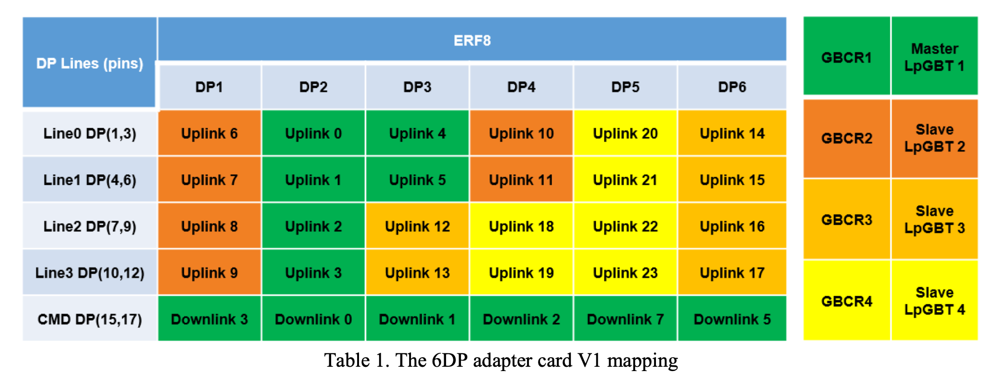
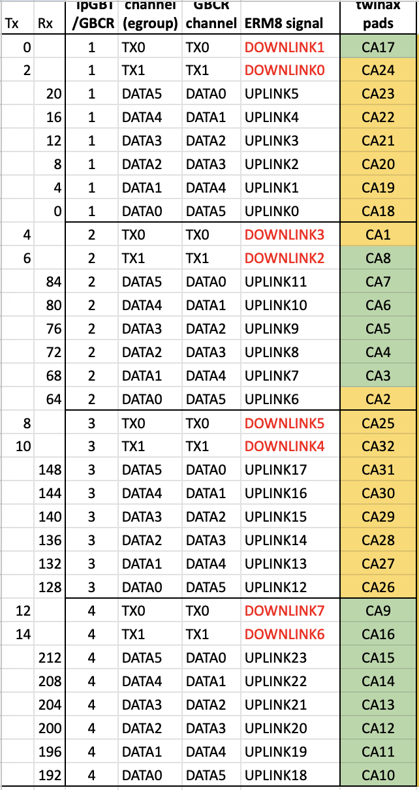

**Different Ports trial with Chip 1 with Digital Scan to configure the module**

| Test Case | Enabled Chip(s) | Connected DP Port | RX | TX | AuroraActiveLane | SerEnLane | Expectation | Result |
|-----------|-----------------|-----------------|----|----|------------------|-----------|-----------|--------|
| 1 | Chip 1 only | 1 | 76 | 6 | 1 | 1  |  | No data read back; have 1 link aligned at 3rd row (see screenshot in notes) |
| 2 | Chip 1 only | 1 | 72 | 6 | 1 | 2  |  | No data read back; have 1 link aligned at 3rd row (see screenshot in notes) |
| 3 | Chip 1 only | 1 | 72 | 6 | 1 | 7  |  | No data read back; have 3 links aligned at 3rd row (see screenshot in notes) |
| 4 | Chip 1 only | 3 | 132 | 0 | 1 | 7  |  | no communication; link at row 1 position 0 |
| 5 | Chip 1 only | 3 | 132 | 2 | 1 | 7 |  | no communication; link at row 0 position 20; row 1 position 0 and position 4|

Swapped row 1 and row 2 by swapping the fibers to let row2 being lpGBT3
DP Port 3:
UPLINK 4, 5, 12, 13. RX 16, 20, 128, 132.

| Test Case | Enabled Chip(s) | Connected DP Port | RX | TX | AuroraActiveLane | SerEnLane | Expectation | Result |
|-----------|-----------------|-----------------|----|----|------------------|-----------|-----------|--------|
| 6 | Chip 1 only | 3 | 132 | 2 | 1 | 1 |  | Good communication! ; link at row 2 position 4 |
| 7 | Chip 1 only | 3 | 128 | 2 | 2 | 1 |  | Good communication! ; link at row 2 position 0 |
| 8 | Chip 1 only | 3 | 20 | 2 | 4 | 1 |  | Good communication! ; link at row 0 position 20 |
| 9 | Chip 1 only | 3 | 20 | 2 | 7 | 1 |  | Good communication! ; link at all three above |

From case (6, 7, 8), we see row 2 position 0 is 128, row 2 position 4 is 132. row 0 position 20 is 20.

DP Port 4:
UPLINK 10, 11, 18, 19. RX 80, 84, 192, 196. 
DOWNLINK 2 TX=4/6? TX=4

| Test Case | Enabled Chip(s) | Connected DP Port | RX | TX | AuroraActiveLane | SerEnLane | Expectation | Result |
|-----------|-----------------|-----------------|----|----|------------------|-----------|-----------|--------|
| 10 | Chip 1 only | 4 | 196 | 4 | 1 | 1 |  | Have Communication but bad (with many errors) need to retry; see link on row 3 position 4 |
| 11 | Chip 1 only | 4 | 196 | 4 | 1 | 1 |  | Same as above |
| 12 | Chip 1 only | 4 | 196 | 6 | 1 | 1 |  | No communication at all |
| 13 | Chip 1 only | 4 | 192 | 4 | 2 | 1 |  | Good communication! ; no error; link on row 3 position 0|
| 14 | Chip 1 only | 4 | 84 | 4 | 4 | 1 |  | Good communication! ; see link on row 1 position 20 |
| 15 | Chip 1 only | 4 | 84 | 4 | 7 | 1 |  | Good communication! ; see link on all three above|

Confirmed TX has to swap within each lpGBT from the table we have
Row 3 position 4 is 196; row 3 position 0 is 192; row 1 position 20 is 84.
DP port first lane may be problematic

DP Port 1:
UPLINK 6, 7, 8, 9. RX 64, 68, 72, 76. 
DOWNLINK 6 = TX 6

| Test Case | Enabled Chip(s) | Connected DP Port | RX | TX | AuroraActiveLane | SerEnLane | Expectation | Result |
|-----------|-----------------|-----------------|----|----|------------------|-----------|-----------|--------|
| 16 | Chip 1 only | 1 | 76 | 6 | 1 | 1 |  | No communication |
| 17 | Chip 1 only | 1 | 72 | 6 | 1 | 2 |  | Good Communication; link seen on row 1 position 8 |
| 18 | Chip 1 only | 1 | 68 | 6 | 1 | 4 |  | No communication |

DP Port 1 lane 1 and 3 may be broken.
row 1 position 12 is 76 (? may be broken). row 1 position 8 is 72. row 1 position 4 is 68 (? may be broken)

DP Port 5:
UPLINK 20 21 22 23. RX 200 204 208 212. 
DOWNLINK 7 = TX 14

| Test Case | Enabled Chip(s) | Connected DP Port | RX | TX | AuroraActiveLane | SerEnLane | Expectation | Result |
|-----------|-----------------|-----------------|----|----|------------------|-----------|-----------|--------|
| 19 | Chip 1 only | 5 | 212 | 14 | 1 | 1 |  | No communication |
| 20 | Chip 1 only | 5 | 208 | 14 | 1 | 2 |  | No communication |
| 21 | Chip 1 only | 5 | 204 | 14 | 1 | 4 |  | Bad but we see communication; link on row 3 position 12 as expected |

DP Port 6:
UPLINK 14 15 16 17. RX 136 140 144 148. 
DOWNLINK 5 = TX 10

| Test Case | Enabled Chip(s) | Connected DP Port | RX | TX | AuroraActiveLane | SerEnLane | Expectation | Result |
|-----------|-----------------|-----------------|----|----|------------------|-----------|-----------|--------|
| 22 | Chip 1 only | 6 | 148 | 10 | 1 | 1 |  | Bad but have communication; link on row 2 position 0 (?? That's RX128 not 148 in principle) |
| 23 | Chip 1 only | 6 | 144 | 10 | 1 | 2 |  | Bad but have communication; link on row 2 position 16 as expected but also extra row 2 position 0 (same as above) |
| 24 | Chip 1 only | 6 | 140 | 10 | 1 | 4 |  | No communication; still see link on row 2 position 0 |

DP Port 6: nothing against the pattern we saw; just overall bad connections.

# Summary 
each lpGBT corresponds to each row in elink check (order is correct now with fiber order white/grey/brown/green). 

With a given DP connected, we define which data lane we write out with SerEnLane. The 1/2/4 represents the Lane (line) 3/2/1 in Table 1. And use Table 1, we find what UPLINK and DOWNLINK we have with the data lane. And use our own table to translate UPLINK DOWNLINK to RX TX to write to the connectivity file. For TX special note, the order in our table is swapped within each lpGBT, but that's WRONG. Don't swap. So, DOWNLINK 0/1/2/3/4/5/6/7/ = TX 0/2/4/6/8/10/12/14.

Now, try multiple DP cables.

| Test Case | Enabled Chip(s) | Connected DP Port | RX | TX | AuroraActiveLane | SerEnLane | Expectation | Result |
|-----------|-----------------|-----------------|----|----|------------------|-----------|-----------|--------|
| 1 | Chip 1 and Chip 2 | Port 2 / 3 | RX 12 / 132 | TX 0 / 2 | 1 | 1 / 1 | Have communication at row 0 positon 12 and row 2 position 4 | problem (not sure if related to using RX 12 which has errors) |
| 2 | Chip 1 and Chip 2 (plugged not not enabled) | Port 2 / 3 | RX 8 / 132 | TX 0 / 2 | 1 | 2 / 1 | Have communication at row 0 positon 12 and row 2 position 4 | Good as normal chip 1 only |
| 3 | Chip 1 and Chip 2 (enabled) | Port 2 / 3 | RX 8 / 132 | TX 0 / 2 | 1 | 2 / 1 | Have communication at row 0 positon 12 and row 2 position 4 | No communication |
| 4 | Chip 1 and Chip 2 (enabled) | Port 2 / 3 | RX 8 / 132 | TX 0 / 0 | 1 | 2 / 1 | Have communication at row 0 positon 12 and row 2 position 4 | No communication |
| 5 | Chip 1 and Chip 2 (enabled) | Port 4 / 3 | RX 192 / 132 | TX 4 / 2 | 1 | 2 / 1 | | Same failure as before |
| 6 | Chip 1 and Chip 2 (enabled) | Port 4 / 3 | RX 192 / 132 | TX 4 / 2 | 1 | 2 / 1 | | Same failure as before |
| 7 | Chip 1 and Chip 2 (enabled) | Port 4 / 3 | RX 192 / 128 | TX 4 / 2 | 1 | 2 / 2 | | Same failure as before |
| 8 | Chip 1 and Chip 3 (enabled) | Port 4 / 3 | RX 192 / 128 | TX 4 / 2 | 1 | 2 / 2 | | Same failure as above |

