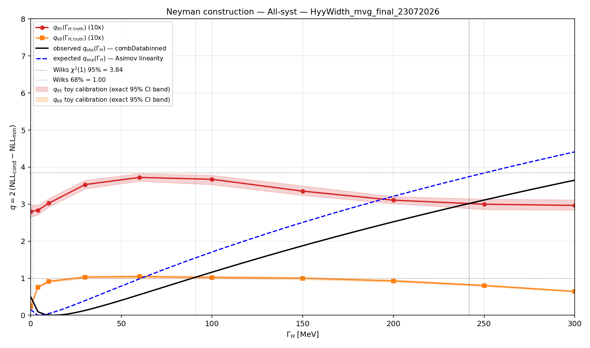
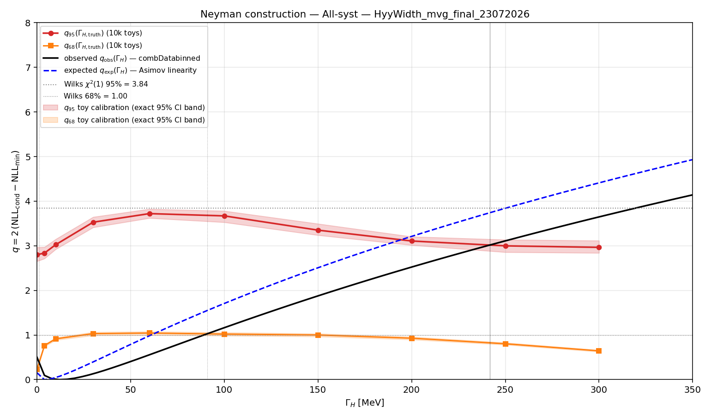
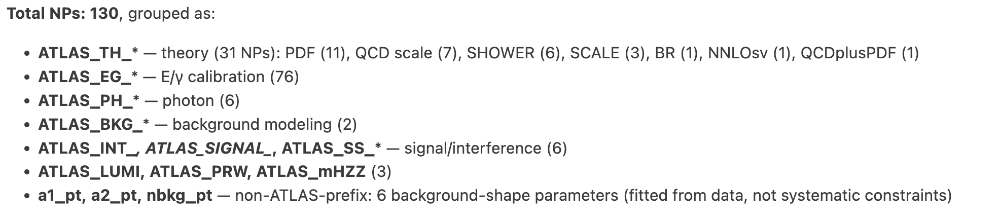

# Paper Draft Comments
- This approach doesn't rely on Higgs coupling to g and W/Z are identical in on-shell and off-shell
- reduced reliability of interference modeling (l140-142)
- When we do higher order correction with a K factor, we don't care consistency? just use the highest order? We need consistency between model and higher order correction factor. l205
- how is cross section change's uncertainty considered in systematic uncertainty? is it included in the profiled function fit?
- where is K_I in the statistical model?

---
# Theory Basis Walkthrough
# Off-shell $\Gamma_H$ measurement: from $d\hat\sigma/d\hat s$ to $\sigma$

Notes on where $\Gamma_H$ enters the on-shell rate, why it drops out off-shell,
and the exact step where $\kappa_{\rm off} = \kappa_{\rm on}$ is assumed.

---

## 1. Setup: the Breit–Wigner partonic cross section

For $gg \to H \to ZZ$ near the pole, the resonant partonic cross section takes the form

$$
\hat\sigma(\hat s) \;=\; \mathcal{N}\,
\frac{\Gamma_{gg}\,\Gamma_{ZZ}}
{(\hat s - m_H^2)^2 + m_H^2\Gamma_H^2}
$$

where $\mathcal{N}$ collects all non-resonant factors — spin averaging, colour factors,
and the $16\pi/\hat s$ flux/phase-space prefactor of the standard $2\to1\to2$
Breit–Wigner formula. None of these carry $\Gamma_H$ dependence, so they can be
carried along as a constant.

The two vertices appear as partial widths:

$$
\Gamma_{gg} \propto \kappa_g^2 ,
\qquad
\Gamma_{ZZ} \propto \kappa_Z^2
$$

---

## 2. The narrow-width approximation

The hadronic cross section requires integrating over $\hat s$ against the parton luminosity
$\mathcal{L}(\hat s)$:

$$
\sigma \;=\; \int d\hat s\; \mathcal{L}(\hat s)\,\hat\sigma(\hat s)
$$

The key numerical fact:

$$
\frac{\Gamma_H}{m_H} \;=\; \frac{4.1\ \mathrm{MeV}}{125\ \mathrm{GeV}} \;\approx\; 3\times 10^{-5}
$$

The Breit–Wigner is extraordinarily narrow — a few MeV — while $\mathcal{L}(\hat s)$ varies
on a scale of tens of GeV. So $\mathcal{L}$ and $\mathcal{N}$ are effectively constant across
the resonance and can be evaluated at $\hat s = m_H^2$ and pulled outside the integral:

$$
\sigma \;\simeq\; \mathcal{L}(m_H^2)\,\mathcal{N}\,\Gamma_{gg}\Gamma_{ZZ}
\int_{-\infty}^{\infty}
\frac{d\hat s}{(\hat s - m_H^2)^2 + m_H^2\Gamma_H^2}
$$

The limits are extended to $\pm\infty$ because the integrand falls as $1/\hat s^{\,2}$;
the error incurred is $\mathcal{O}(\Gamma_H/m_H)$.

---

## 3. The integral that produces $\pi/(m_H\Gamma_H)$

Substitute $x = \hat s - m_H^2$ and $a = m_H\Gamma_H$:

$$
\int_{-\infty}^{\infty}\frac{dx}{x^2 + a^2}
\;=\; \frac{1}{a}\left[\arctan\frac{x}{a}\right]_{-\infty}^{\infty}
\;=\; \frac{1}{a}\left[\frac{\pi}{2} - \left(-\frac{\pi}{2}\right)\right]
\;=\; \frac{\pi}{a}
$$

Hence

$$
\int_{-\infty}^{\infty}
\frac{d\hat s}{(\hat s - m_H^2)^2 + m_H^2\Gamma_H^2}
\;=\; \frac{\pi}{m_H\,\Gamma_H}
$$

> **Intuition.** This is just the area of a Lorentzian. A Lorentzian of half-width $a$
> has peak height $1/a^2$ and characteristic width $a$, so its area scales as
> $(1/a^2)\times a = 1/a$, with the exact coefficient $\pi$.

---

## 4. Assembling the on-shell result

$$
\sigma_{\rm on} \;\simeq\;
\underbrace{\mathcal{L}(m_H^2)\,\mathcal{N}\,\frac{\pi}{m_H}}_{\text{no }\Gamma_H\ \text{dependence}}
\;\cdot\;\frac{\Gamma_{gg}\,\Gamma_{ZZ}}{\Gamma_H}
$$

Recognise the physical factorisation:

$$
\sigma_{\rm on} \;=\; \sigma_{ggF}\times \mathrm{BR}(H\to ZZ),
\qquad
\sigma_{ggF}\propto \Gamma_{gg},
\qquad
\mathrm{BR} = \frac{\Gamma_{ZZ}}{\Gamma_H}
$$

**Bookkeeping of the $1/\Gamma_H$:** the integral supplied one power of $1/\Gamma_H$;
that single power is exactly what converts $\Gamma_{ZZ}$ into the branching ratio
$\Gamma_{ZZ}/\Gamma_H$. In terms of coupling modifiers:

$$
\boxed{\;\sigma_{\rm on} \;\propto\; \frac{\kappa_g^2\,\kappa_Z^2}{\Gamma_H}\;}
$$

---

## 5. The off-shell region

For $\hat s \gg m_H^2$ the narrow-width trick does not apply — there is no peak to
integrate over, so the full integrand is kept. Compare the two denominator terms at
$\sqrt{\hat s} = 400$ GeV:

$$
(\hat s - m_H^2)^2 = (160000 - 15625)^2\ \mathrm{GeV}^4 \approx 2\times 10^{10}\ \mathrm{GeV}^4
$$

$$
m_H^2\Gamma_H^2 = (125)^2(0.0041)^2\ \mathrm{GeV}^4 \approx 2.6\times 10^{-4}\ \mathrm{GeV}^4
$$

Fourteen orders of magnitude apart. The width term is utterly negligible:

$$
\hat\sigma_{\rm off}(\hat s) \;\simeq\;
\mathcal{N}\,\frac{\Gamma_{gg}\,\Gamma_{ZZ}(\hat s)}{(\hat s - m_H^2)^2}
$$

$$
\boxed{\;\sigma_{\rm off} \;\propto\; \kappa_g^2\,\kappa_Z^2\;}
$$

$\Gamma_H$ has vanished entirely. The reason is structural: $\Gamma_H$ entered only as the
**regulator of the pole**, and off-shell there is no pole to regulate.

---

## 6. The ratio, and the assumption

$$
\frac{\sigma_{\rm off}}{\sigma_{\rm on}}
\;=\;
\frac{\kappa_g^2(\hat s_{\rm off})\,\kappa_Z^2(\hat s_{\rm off})}
{\kappa_g^2(m_H^2)\,\kappa_Z^2(m_H^2)\big/\Gamma_H}
$$

Equivalently, in signal-strength language with $\mu_{\rm on} = \kappa^4/(\Gamma_H/\Gamma_H^{\rm SM})$
and $\mu_{\rm off} = \kappa^4$:

$$
\frac{\Gamma_H}{\Gamma_H^{\rm SM}} \;=\; \frac{\mu_{\rm off}}{\mu_{\rm on}}
$$

**The cancellation of the numerators is the single step where
$\kappa_{\rm off} = \kappa_{\rm on}$ is used.** Without it, what is actually measured is

$$
\frac{\mu_{\rm off}}{\mu_{\rm on}}
\;=\;
\frac{\Gamma_H}{\Gamma_H^{\rm SM}}\times
\left[\frac{\kappa(\hat s_{\rm off})}{\kappa(m_H^2)}\right]^{4}
$$

Note the **fourth power**: a 20% enhancement of the off-shell coupling gives
$1.2^4 \approx 2$, i.e. a factor-two shift in the inferred width. The degeneracy between
"large width" and "energy-growing coupling" is therefore severe.

### Why the couplings could genuinely differ

The two measurements sit at $\sqrt{\hat s}\approx 125$ GeV and $\sqrt{\hat s}\gtrsim 400$ GeV.

- **The ggF loop resolves.** At 125 GeV, well below $2m_t = 346$ GeV, the top loop is
  point-like and the heavy-top EFT applies. Above the $t\bar t$ threshold the loop is
  resolved and the effective $ggH$ vertex acquires genuine $\hat s$-dependence. In the SM
  this is calculable; a new heavy coloured state of mass $M$ behaves the same way,
  looking like a contact term at 125 GeV and resolving near $\hat s \sim 4M^2$.
- **Dimension-6 operators grow with energy.** An amplitude ratio $\sim \hat s/\Lambda^2$
  changes by a factor $\sim 16$ between $(125\ \mathrm{GeV})^2$ and $(500\ \mathrm{GeV})^2$.
  An operator invisible in on-shell coupling fits can produce an $\mathcal{O}(1)$
  off-shell effect that mimics a large width exactly.
- **New states in the tail.** A second scalar or a threshold above $2m_Z$ contaminates
  $\sigma_{\rm off}$ directly.

### Secondary assumptions

- The $gg\to ZZ$ continuum box is SM. The interference term
  $2\,\mathrm{Re}(A_H A_{\rm box}^*)$ carries much of the sensitivity, so a non-SM
  continuum biases the result.
- QCD corrections to the loop-induced continuum are known. $gg\to ZZ$ is available only
  at approximate NLO, and signal/background $K$-factors are usually assumed equal —
  one of the leading systematics in published analyses.

---

## 7. Caveat on $\Gamma_{ZZ}(\hat s)$

Above $\Gamma_{ZZ}$ was written as if constant, but off-shell it is strongly
$\hat s$-dependent. Below $2m_Z = 182$ GeV one $Z$ must be virtual; above threshold the
longitudinal polarisations give roughly

$$
\Gamma_{ZZ}(\hat s) \;\propto\; \frac{\hat s^{\,3}}{m_Z^4\, v^2}
$$

This growth is what keeps the off-shell tail observable despite the
$1/(\hat s - m_H^2)^2$ suppression — roughly 10% of the total Higgs-mediated $gg\to ZZ$
rate lies above $2m_Z$. It is also why the tail must eventually be tamed by destructive
interference with the continuum box: the signal alone would violate unitarity.

None of this affects the $\Gamma_H$ power counting above.

---

## 8. Contrast with the $H\to\gamma\gamma$ interference method

Both methods use the same trick: find a quantity **linear** in the Higgs amplitude
$A_H$ and ratio it against the on-shell rate, which is **quadratic**. The couplings then
cancel and $\Gamma_H$ survives.

| | Off-shell $ZZ$ | $\gamma\gamma$ interference |
|---|---|---|
| Linear quantity | $\sigma_{\rm off}$, reached by moving in $\hat s$ | peak shift $\Delta m$ from $2\,\mathrm{Re}(A_H A_{\rm box}^*)$, at fixed $\hat s$ |
| Compares | rate at 125 GeV vs rate at $\gtrsim 400$ GeV | peak **height** vs peak **position**, both at 125 GeV |
| Fails if | couplings run with energy (dim-6 operators, resolved loops, new states in the tail) | couplings carry a BSM phase, or non-SM sign, or $gg\to\gamma\gamma$ box is non-SM |
| Immune to | phases (rates depend on $\lvert\kappa\rvert^2$) | energy growth — never leaves the pole |

The step in §6 where $\kappa_{\rm off} = \kappa_{\rm on}$ is invoked simply **has no
counterpart** in the $\gamma\gamma$ analysis. That is the precise content of the
complementarity claim: the two methods fail under **disjoint** BSM scenarios.

In the $\gamma\gamma$ case the coupling factor is eliminated instead via

$$
\kappa_g \kappa_\gamma \;=\; \sqrt{\mu\,\Gamma_H/\Gamma_H^{\rm SM}}
$$

using the measured on-shell signal strength $\mu$ — a square root because the signal is
quadratic in $A_H$ while the interference is linear.

# Toys Validation
With the 10* toys, build the new curve.

With Obs and Exp dataset, build their q vs Gamma_H curve. 

Intersect the above mentioned to find the 95% UL and 68% UL

3 configurations: All / FixTheory / Stat-only

Easy to get the q_Obs q_Exp for these three types: $$q_{obs}^{All}, q_{obs}^{FixTh}, q_{obs}^{Stat}$$; but our toys generation also need to adjust accordingly. We currently only have: $$q_{95}^{All}$$. 

\[
\text{95\% CI (All)}
=
\left\{
\Gamma_H :
q_{\mathrm{obs}}^{\mathrm{All}}(\Gamma_H)
=
q_{95}^{\mathrm{All}}(\Gamma_H)
\right\}
\]

\[
\text{95\% CI (Fix Theory)}
=
\left\{
\Gamma_H :
q_{\mathrm{obs}}^{\mathrm{FixTh}}(\Gamma_H)
=
q_{95}^{\mathrm{FixTh}}(\Gamma_H)
\right\}
\]

\[
\text{95\% CI (Stat Only)}
=
\left\{
\Gamma_H :
q_{\mathrm{obs}}^{\mathrm{Stat}}(\Gamma_H)
=
q_{95}^{\mathrm{Stat}}(\Gamma_H)
\right\}
\]

Can get a rough one using the $$q_{95}^{All}$$ for now.

Currently writing a script to only read nllscan of the 10x toys and get the curve plot for 10x toys.

10x toys with All NPs profiled:

NP grouping:

