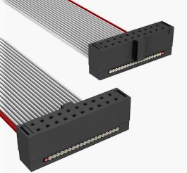
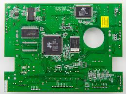
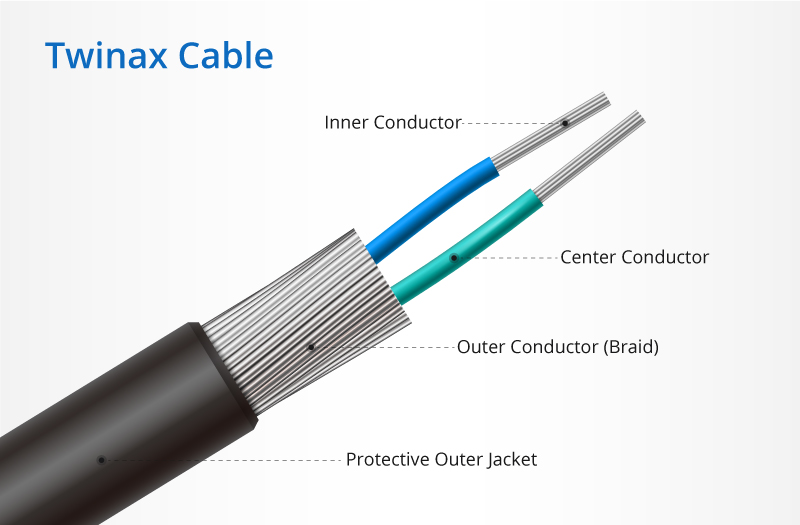

QC: Quality Control
QA: Quality Assurance
IS: Inner System
OB: Outer Barrel
OEC: Outer Endcap
CLApp: Cell Loading App

Components/Connectors:
pigtail: ribbon cable

PCB: Printed Circuit Board

Twinax cable

