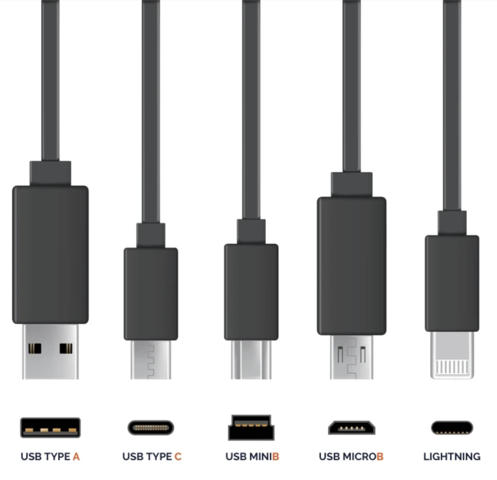
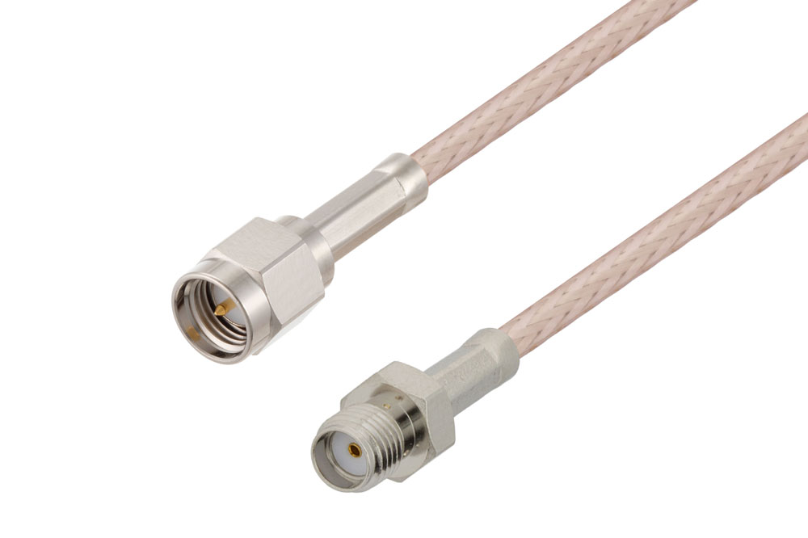

QC: Quality Control
QA: Quality Assurance
IS: Inner System
OB: Outer Barrel
OEC: Outer Endcap
CLApp: Cell Loading App
MQMT: Module QC Measurement tools
MQAT: Module QC Analysis tools
MOPS: Monitoring of Pixel System
SLDO: Shunt Low-DropOut regulator

Components/Connectors:
pigtail: ribbon cable

PCB: Printed Circuit Board

Twinax cable

USB ports:

SMA male and female:

