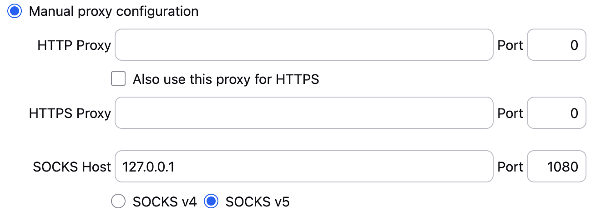

## Links
https://cell-loading-app.docs.cern.ch/en/Installation/

https://atlas-itk-pixel-localdb.docs.cern.ch

## Remote Access
For remote access to WebInterface of Microservices dashboard and LocalDB (and later CLApp):
ssh -f -N -D 1080 felix3-atlas to set up a tunnel
And set up Firefox proxy (settings search for proxy like below)
1080 is arbitrary choice, 127.0.0.1 is meaningful that points to talking to the machine itself.

