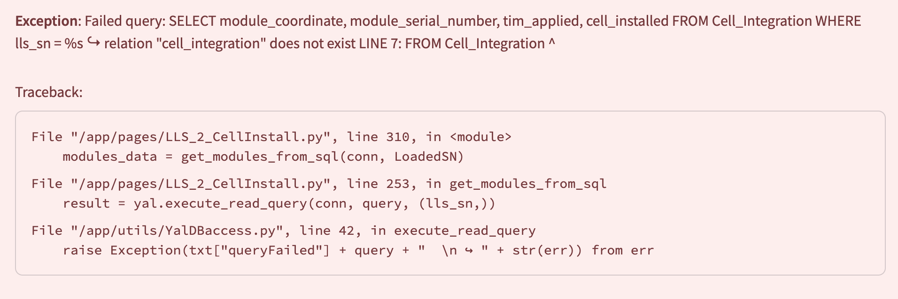

## Links
https://cell-loading-app.docs.cern.ch/en/Installation/

https://atlas-itk-pixel-localdb.docs.cern.ch

## Remote Access
For remote access to WebInterface of Microservices dashboard and LocalDB (and later CLApp):
ssh -f -N -D 1080 felix3-atlas to set up a tunnel
And set up Firefox proxy (settings search for proxy like below)
1080 is arbitrary choice, 127.0.0.1 is meaningful that points to talking to the machine itself.




# CLApp deployment & IS-port work report

_SLAC deployment of CLApp (Cell Loading App) on felix3. Written 2026-08-21._

## Environment

- Host **felix3** (`192.168.1.202`), repo `/home/atlas/clapp`, branch `master`
- **UI: http://192.168.1.202:8501** — *not* `134.79.77.194` (that's the SLAC NAT address
  Streamlit prints in its startup log; it doesn't route back to this box)
- `.env` → `config/slac_config.env` symlink, created by `setup.sh`
- Containers: `clapp-app-1`, `clapp-yaldb-1`. **App has no restart policy (deliberate)** —
  after a reboot or `docker compose stop`, run `docker compose up -d`

## Changes made

`compose.override.yaml` (new, untracked) — publishes YalDB on host port **5442** instead of
5432, which is held by the unrelated `atlas-postgres` container. Without this the yaldb
container came up detached from the compose network and the app couldn't resolve its own
database. The `ports: !override` tag is required — a plain override *appends* to the base
list, keeping the conflicting mapping and failing to bind.

Nothing else in the repo was modified.

## Verified working

| Check | Command |
|---|---|
| YalDB | `python touchYalDB.py --host localhost --port 5442` — create/insert/read/drop all pass |
| LocalDB | `python touchLocalDB.py --host atlascr --port 27017 --user admin --password slac` — pass |
| App → DB | `yaldb:5432` resolves from inside `clapp-app-1` |
| ProdDB | authenticated; LLS flow reachable with TEST Mode off |

Host `/usr/bin/python` has none of `requirements.txt`; the DB test scripts were run from a
throwaway venv. A real project venv is still to be set up.

## Gotchas worth remembering

- **`generalAppConfig.py` needs env vars exported manually.** `setup.sh` only makes the
  symlink; compose injects the env only inside the container. The `KEY= "value"` format
  (space after `=`) breaks a plain `source`. Use:

  ```bash
  set -a; eval "$(sed -e 's/[[:space:]]*#.*$//' -e '/^[[:space:]]*$/d' -e 's/=[[:space:]]*/=/' .env)"; set +a
  ```

- **Serial-number rules are mode-dependent** (`appCode/utils/app_utils.py:264-345`).
  Format is `20U` + `XX` (project+subproject, unvalidated) + `YY` (type code) + 7 digits.

  - Pure TEST (PDB off): identifier must **not** parse as a real SN → `TESTMOD1`
  - TEST + PDB: must be a valid SN with a dummy `YY` → `XM` module, `XC` carrier,
    `ZP` bare cell, `ZS` loaded cell, `ZT`/`ZU` LLS
  - Production (TEST off): real codes accepted, dummy codes rejected.
    **`20UPBLL0000004` only works here.**
  - Toggling mode mid-session fires `ResetAll()` and clears the loaded reference.

- **Production mode performs real ProdDB writes** on the upload pages.
- `config/slac_config.env` is **not** gitignored and holds `LOCALDB_PASSWORD` + PDB codes.

## Open issues

1. **Missing `Cell_Integration` table** — `appCode/pages/LLS_2_CellInstall.py:253` queries it;
   YalDB was built from `YalDB_dump_LPSC.sql`, which predates the code. The table *is* defined
   in `structureDB/makeDBTables.py:474`. **This blocks the Cell installation step.** Not yet created.
2. `LOCALDB_PORT=27017` is used for the LocalDB *web-interface* URL at
   `appCode/utils/LocalDBaccess.py:195`; the Mongo connection is hardcoded to 27017 separately.
   Confirmed intentional.

---

# IS port analysis

Full write-up: https://claude.ai/code/artifact/4a773cce-cffb-430c-9046-073c6b645132

**Reusable as-is:** `appCode/utils/ProdDBaccess.py` (1,121 lines, geometry-blind) and
`UploadAssembly` (`LLS_utils.py:866-970` — breadth-first walk over `role` / `serialNumber` /
`order`; works at any depth).

**Additive:** enums + 5 lookup maps at `LLS_utils.py:349-551`.

**Hardcodes exactly 3 levels** (LS → PP0 → HV group → module) — this is where
"different but similar" bites:

- `_AssemblyGraph` — three literal nested loops, `k.startswith("HV-")`
- `DisplayAssembly` — walks up exactly two `predecessors()`
- `_MappingToAssemblyGraph` — depth is the literal dict shape (~400 lines)
- `_match_mapping_to_schema` — OB string heuristics (`"6" in code`, `order==1` ⇒ A-side)

**Recommended approach:** same pages, routed automatically by `componentType.code` — *not*
separate IS pages (`pages/LLS_5_Upload.py` is already fully generic at 102 lines). Make the
layer chain declarative (an ordered `layers` list plus a uniform `children` tree in data), so
the graph builder recurses and depth comes from data. `appCode/utils/yaml_tools.py` is an
unused YAML loader with `!include` support already in the repo. Refactor OB first, using the
existing planning uploads as the regression fixture, then add IS as a second data set.

## Still needed from the IS side

- Exact ProdDB `componentType.code` / `type.code` strings **and the subproject code** — read it
  off characters 4-5 of any IS serial number (`20U`**`PB`**`LL…` for OB). Hardcoded `"PB"` at
  `ProdDBaccess.py:597` (silently empties the planning dropdowns) and `LLS_utils.py:923`.
- **Whether ProdDB already declares child slots for the IS component types** —
  `_GetSlotID` (`ProdDBaccess.py:902-932`) matches on `(componentType, type, order)` within the
  parent's existing `children`. No slots ⇒ upload cannot work at all. Highest-risk unknown.
- IS layer structure (confirmed different but similar — needs specifics), `PLANNING` test type
  availability, EDMS-equivalent mapping document, functional/loaded pattern, stage names,
  position-labelled drawings.

## Also noted

- `pages/LLS_3_pp0Install.py` and `pages/LLS_4_PigtailsConnect.py` are 11-line stubs.
- `UploadPlanning` has `client=st.session_state.itkdbCli` as a **default argument**, evaluated
  at import time. Importing `LLS_utils` outside a live Streamlit session raises
  `AttributeError` — harmless in the app, but it blocks headless testing of the graph engine.
